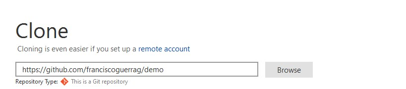
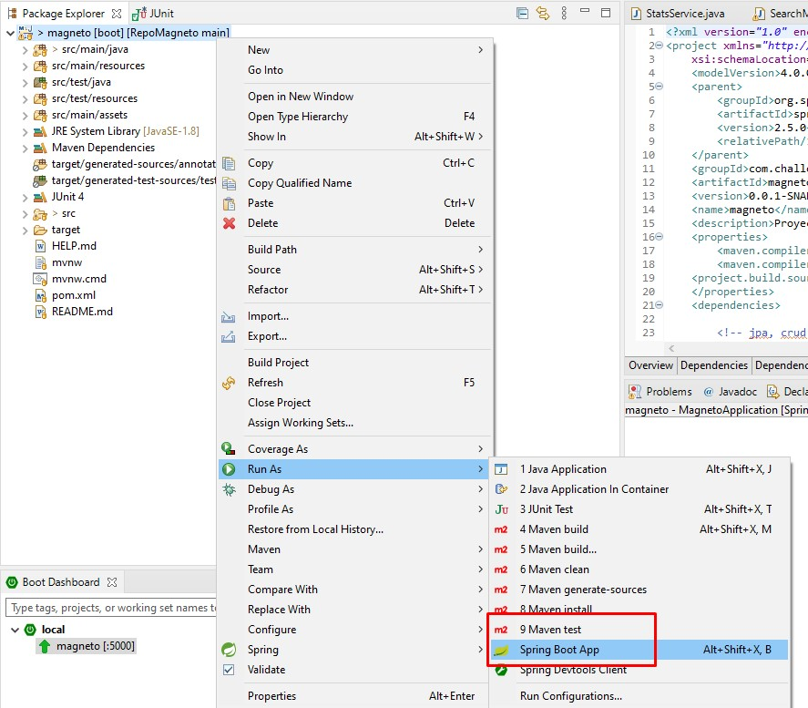

# PROYECTO MAGNETO

Magneto quiere reclutar la mayor cantidad de mutantes para poder luchar contra los X-Men. 
Este proyecto detecta si un humano es mutante basándose en su secuencia de ADN. 

* Para encontrar un mutante se deben enviar el ADN mediante una fila de una tabla de (NxN) con la secuencia del ADN.
* Las letras de los caracteres solo pueden ser: (A,T,C,G), las cuales representa cada base nitrogenada del ADN. 
 
**NOTA**

**No se harán validaciones de la entrada para no afectar rendimiento**  ya que se asumen como valores validos las letras A,T,C,G y una tabla NXN.

### Instrucciones para ejecutar la API 🚀

**PLATAFORMAS**

**AWS** :zap: 
Se utilizo el cloud computing Amazon AWS para el despliegue de la aplicación, el proyecto para encontrar mutantes se encuentra desplegado en AWS Elastic Beanstalk.

Revisa el enlace
http://magnetochallenge-env.eba-tbycugxf.us-east-1.elasticbeanstalk.com/

**Heroku** :ocean:
La base de datos se encuentra desplegada en la plataforma de computación en la nube Heroku

**PostgreSQL** :open_file_folder:
La base de datos definida para el proyecto es PostgreSQL

**EJECUCIÓN**

Mediante la herramienta POSTMAN podrá ejecutar los siguientes servicios disponibles en la nube

**Servicios Principales** 

> POST → /mutant/
> 
> * Servicio para analizar mutantes, se debe enviar como parametro un ADN valido. 
> * Ejemplo
> 
>   { “dna”:["ATGCGA","CAGTGC","TTATGT","AGAAGG","CCCCTA","TCACTG"]}
> 
>   http://http://magnetochallenge-env.eba-tbycugxf.us-east-1.elasticbeanstalk.com/mutant

> GET → /stats
> 
> * Servicio para obtener estatisticas de humanos y mutantes, ademas del porcentaje de mutantes encontrados 
> http://magnetochallenge-env.eba-tbycugxf.us-east-1.elasticbeanstalk.com/stats

**Servicios Secundarios** 

> GET → /humans
> 
> * Servicio para obtener todos los humanos analizados, con su ADN y si se encontró como mutante o no.
> http://magnetochallenge-env.eba-tbycugxf.us-east-1.elasticbeanstalk.com/humans.
> 
> Ejemplo Respuesta
> > [{"isMutant":true,"dna":["ATGCAA","BAGTGC","TTATGT","AGAAGG","CCCCTA","TCACTG"],"id":99},{"isMutant":true,"dna":["ATGCAA","BAGTGC","TTATGT","AGAAGG","CCCCTA","TCACTG"],"id":100},{"isMutant":false,"dna":["TTGCAA","BAGTGC","TTATGT","AGAATG","CCCCTA","TCACTG"],"id":101},{"isMutant":false,"dna":["TTGCAA","BAGTGC","TTATGT","AGAATG","CCCCTA","TCACTG"],"id":102},{"isMutant":false,"dna":["TTGCAA","BAGTGC","TTATGT","AGAATG","CCCCTA","TCACTG"],"id":103},{"isMutant":false,"dna":["TTGCAA","BAGTGC","TTATGT","AGAATG","CCCCTA","TCACTG"],"id":104},{"isMutant":false,"dna":["TTGCAA","BAGTGC","TTATGT","AGAATG","CCCCTA","TCACTG"],"id":105},{"isMutant":false,"dna":["TTGCAA","BAGTGC","TTATGT","AGAATG","CCCCTA","TCACTG"],"id":106}]
> > 

> delete → /deleteHumans
> 
> * Servicio para eliminar los humanos analizados. 
> 
>   http://magnetochallenge-env.eba-tbycugxf.us-east-1.elasticbeanstalk.com/deleteHumans

### Instrucciones para Instalar y Desplegar en Ambiente Local 🛠️

Estas instrucciones te permitirán obtener una copia del proyecto en funcionamiento en tu máquina local para propósitos de desarrollo y pruebas.

### Pre-requisitos 📋

* Software de Control de Versiones GIT
* Entorno de Desarrollo Java (Para la creación se utilizo Spring Tools Suite).
* Version de Java (Se utilizó Java 1.8)
* Maven ( Se utilizó apache-maven-3.6.3)
* Spring 2.5.0
* Base de datos (Se utilizo postgresql)

**Nota**
Para proposito de pruebas se utilizó base de datos embebida H2

### Instalación 🔧

* Clonar el proyecto desde el siguiente enlace https://github.com/franciscoguerrag/magneto

  

* Importar el proyecto en el ID utilizando Import-> Existing Maven Projects.

  

* Ejecutar los diferentes servicios del Proyecto (puerto configurado 5000, se optó por este puerto por que se realizó despliegue para producción en AWS y este es el puerto por defecto para servicio gratuito)

**Servicios Principales** 

> POST → /mutant/
> 
> * Servicio para analizar mutantes, se debe enviar como parametro un ADN valido. 
> * Ejemplo
> 
>   { “dna”:["ATGCGA","CAGTGC","TTATGT","AGAAGG","CCCCTA","TCACTG"]}
> 
>   http://localhost:5000/mutant

> GET → /stats
> 
> * Servicio para obtener estatisticas de humanos y mutantes, ademas del porcentaje de mutantes encontrados 
> http://localhost:5000/stats

**Servicios Secundarios** 

> GET → /humans
> 
> * Servicio para obtener todos los humanos analizados, con su ADN y si se encontró como mutante o no.
> http://localhost:5000/humans.
> 
> Ejemplo Respuesta
> > [{"isMutant":true,"dna":["ATGCAA","BAGTGC","TTATGT","AGAAGG","CCCCTA","TCACTG"],"id":99},{"isMutant":true,"dna":["ATGCAA","BAGTGC","TTATGT","AGAAGG","CCCCTA","TCACTG"],"id":100},{"isMutant":false,"dna":["TTGCAA","BAGTGC","TTATGT","AGAATG","CCCCTA","TCACTG"],"id":101},{"isMutant":false,"dna":["TTGCAA","BAGTGC","TTATGT","AGAATG","CCCCTA","TCACTG"],"id":102},{"isMutant":false,"dna":["TTGCAA","BAGTGC","TTATGT","AGAATG","CCCCTA","TCACTG"],"id":103},{"isMutant":false,"dna":["TTGCAA","BAGTGC","TTATGT","AGAATG","CCCCTA","TCACTG"],"id":104},{"isMutant":false,"dna":["TTGCAA","BAGTGC","TTATGT","AGAATG","CCCCTA","TCACTG"],"id":105},{"isMutant":false,"dna":["TTGCAA","BAGTGC","TTATGT","AGAATG","CCCCTA","TCACTG"],"id":106}]
> > 

> delete → /deleteHumans
> 
> * Servicio para eliminar los humanos analizados. 
> 
>   http://localhost:5000/deleteHumans

## Ejecutando las pruebas ⚙️

* Para las pruebas se utilizó **JUNIT 5** y la base de datos embebida **H2**

**Cobertura**

* La cobertura del código es de 93.7%
* La función principal
  boolean isMutant(String[] dna); 
  Tiene **Code coverage 100%**. 

## Despliegue 📦

Desplegar en AWS, Google Cloud o Heroku (Se utilizó AWS en este caso)

**Nota**

En versiones iniciales registradas en GitHub se realizaron pruebas en Google Cloud y Cloud SQL

## Construido con 🛠️

* [Java](https://www.java.com/) - Lenguaje programación
* [Maven](https://maven.apache.org/) - Manejador de dependencias
* [AWS](https://aws.amazon.com/es/console/) - Cloud Computing
* [Heroku](https://dashboard.heroku.com/apps/) - Cloud Computing
* [Postgresql](https://maven.apache.org/) - Base de datos (Para pruebas se utilizó base de datos Embebida H2)

## Autores ✒️

* **Francisco Guerra** - *Proyecto Magneto* - [franciscoguerrag](https://github.com/franciscoguerrag)

## Expresiones de Gratitud 🎁

*  Reto desarrollado para ingreso a Mercado Libre 🍺 ☕ . 

